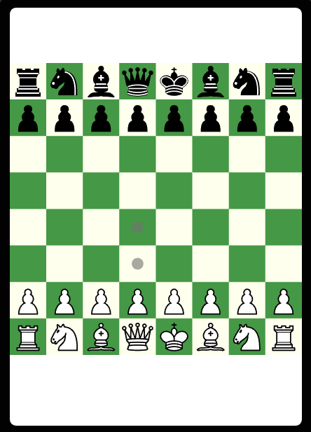
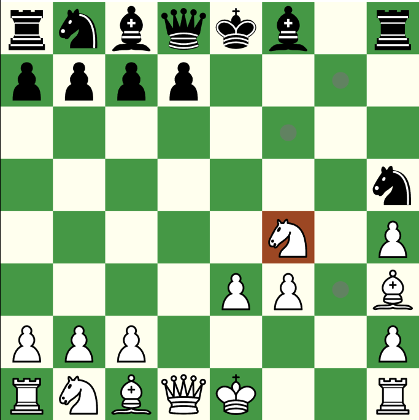
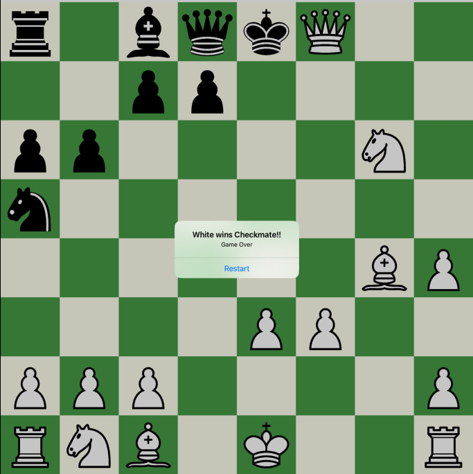

# Chess
building simple chess game by using Swift language for IOS.

## Overview
This project uses the Swift Package Manager (.swiftpm) for dependency management. using brute-force method to simple create this game, and following are features
- draw possible moves and attack square
- checkmate Status alert and restart
- when got check need to force move king or block with other pices

 

## Usage
### Swift Package Manager
The Swift Package Manager is a tool for managing the distribution of Swift code. It’s integrated with the Swift build system to automate the process of downloading, compiling, and linking dependencies.

#### Installation
To add a package dependency to your Xcode project, select File > Swift Packages > Add Package Dependency and enter its repository URL. You can also manually edit the `Package.swiftpm` file to add a package dependency.

#### Updating Packages
To update the package dependencies for your app, select File > Swift Packages > Update to Latest Package Versions.

#### Removing Packages
To remove a package dependency from your app, select the package from the Swift Packages section of the Project Editor and click the minus button (-) in the bottom-left corner.
